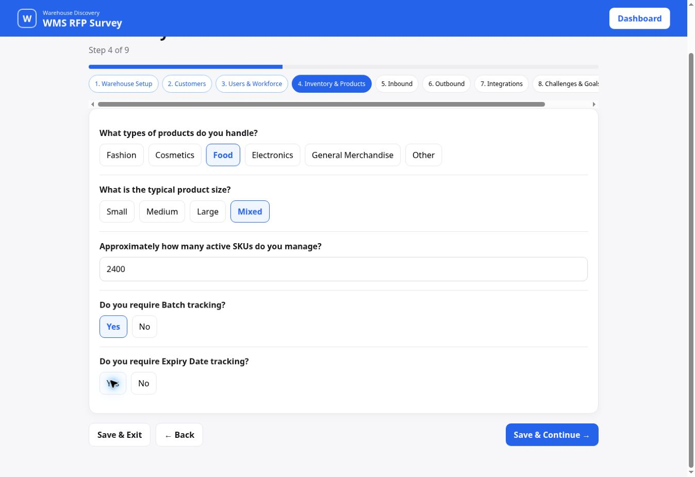
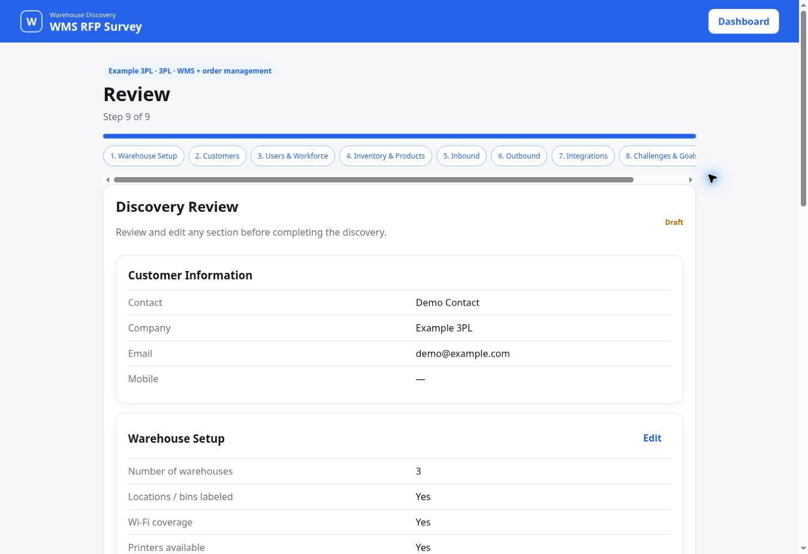
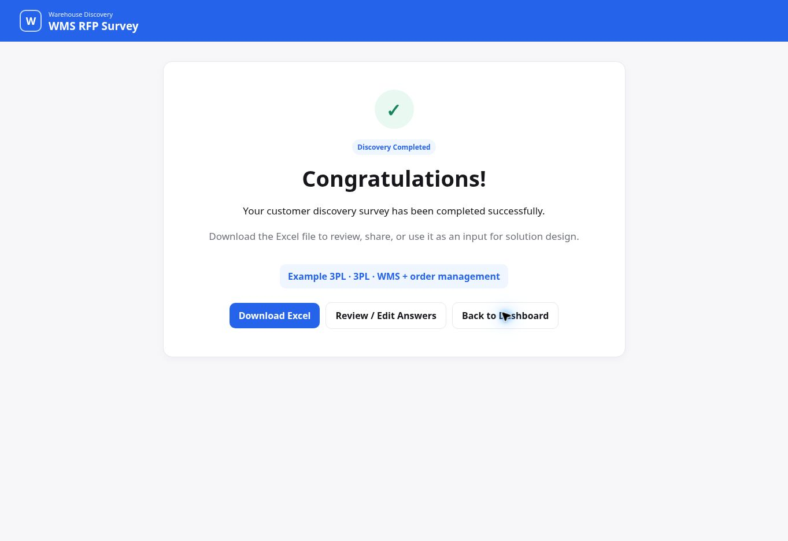

# WMS RFP Survey

**Turn warehouse discovery into structured, reviewable requirements.**

[**Live Demo →**](https://hassansaber1911-dot.github.io/WMS-RFP-Survey/)

An independent, vendor-neutral prototype for 3PL warehouse and order-management discovery.

## Product Preview

Real screenshots from the live application using an example 3PL and synthetic contact details.

### Capture inventory rules

### Review the discovery before handover

### Complete and export the record

## The problem
Discovery spread across meetings, notes and spreadsheets can miss critical warehouse, inventory, inbound, outbound and integration requirements. Those gaps can surface too late during implementation.

## MVP and user flow
Create a customer record → work through nine discovery stages → save and resume → review/edit answers → complete → export.

The stages cover Warehouse Setup, Customers, Users & Workforce, Inventory & Products, Inbound, Outbound, Integrations, Challenges & Goals, and Review.

## Product decisions and business rules
**Coverage without a rigid script.** Structured questions and free-text context serve different purposes.

**Relevant follow-ups.** Conditional questions adapt to operational answers.

**Multi-session discovery.** Drafts auto-save locally and can be resumed.

**Portable handover.** An Excel-compatible export brings answers into existing review workflows.

**Progress is workflow progress.** Completion records a user action; it does not certify that every answer is complete or that a vendor meets the requirements.

## Measurement
GA4 events are implemented for discovery start, stage completion, completion and export. Customer/contact fields and free-text answers are excluded from event parameters. No conversion or implementation-efficiency results are claimed.

## Validation and current limits
Live flow checked on 6 October 2026: customer record creation, warehouse/customer/inventory answers, save/resume, review, completion and successful export download. The example uses **3 warehouses**, **12 customers** and **2,400 SKUs** with batch/expiry needs.

Data persists in the current browser. There are no authenticated teams, cloud records, CRM integration or automated vendor scoring. Export is an Excel-compatible file generated in the browser.

---
Built by **Hassan Mohamed Saber** · Independent product prototype
